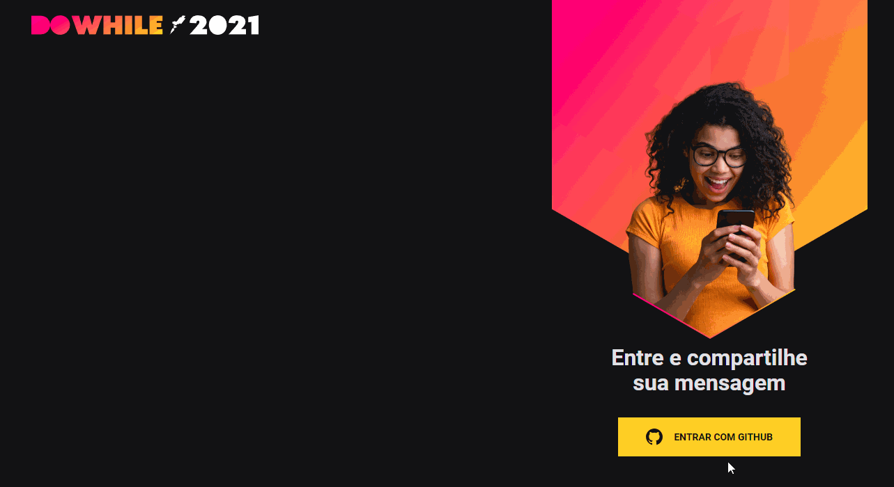

# Do While Comments

Projeto do NLW 07 da [Rocketseat](https://rocketseat.com.br/). Aplicação com front desenvolvido em ReactJS e back em NodeJS. Sistema onde o usuário pode realizar login via GitHub e consegue cadastrar seus comentários sobre o evento.

## ✨ Preview

## 🛠 Builded with

##  About me

- 👤 Bacharel em jornalismo se aventurando pelo mundo da programação, estudando stacks relacionadas ao front-end, focado em ReactJS

- 🔭 Me encontre:  
